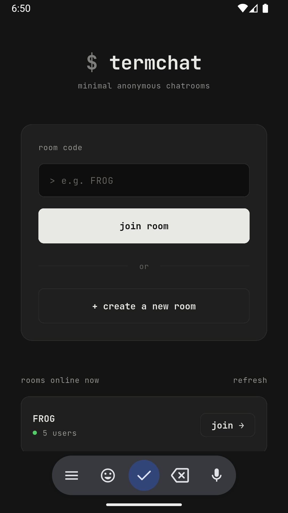

# termchat-mobile

The mobile companion to termchat.

termchat-mobile brings the same anonymous, room-based realtime chat experience from the terminal to Android and iOS, while reusing the same backend infrastructure and room system.

Create a room, share a code, and start chatting instantly.

No accounts.
No profiles.
No friction.

---

# Features

* Anonymous realtime chat rooms
* Zero account creation
* Public room discovery
* Create and join rooms instantly
* Password-protected rooms
* Host privileges and automatic host succession
* Online users list
* Mention highlighting (`@user`)
* Nickname customization
* Nickname color customization
* Dark / Light / System themes
* Mobile-first experience
* Realtime WebSocket messaging
* Responsive interface
* Shared backend with termchat CLI

---

# Screenshots

| Home                                    | Chat                                 | Settings                    |
| --------------------------------------- | ------------------------------------ | --------------------------- |
|        |                                      |                             |
| Browse active rooms and create new ones | Realtime messaging with online users | Personalize your experience |

---

# Room System

Rooms are:

* Temporary
* Automatically created on demand
* Shareable through room codes
* Public or password protected
* Managed by the room host

The first user to join a room becomes the host.

When the host disconnects, ownership is automatically transferred to the next oldest participant in the room.

---

# Joining a Room

Join a room by:

* Selecting a public room from discovery
* Entering a room code
* Opening a shared room invitation
* Creating a new room

Room codes are compatible with the existing termchat ecosystem.

---

# Chat Features

* Realtime messaging
* Online users panel
* Host indicators
* Join and leave notifications
* Mention highlighting
* Automatic reconnection
* Fast message synchronization

Example:

```text
Ishaan: hey @zack
Zack: sup
Dex: room's working now
```

---

# Compatibility

termchat-mobile uses the same backend protocol as termchat.

Users on mobile and terminal clients can participate in the same room simultaneously.

```text
Terminal Client
        │
        ▼
   termchat API
        ▲
        │
Mobile Client
```

---

# Technologies

* Flutter
* BLoC
* WebSockets
* Go Backend
* Material 3
* Cross-platform architecture

---

# Philosophy

termchat is designed to feel:

* Instant
* Anonymous
* Lightweight
* Temporary
* Frictionless

Whether you're in a terminal or on your phone, joining a conversation should take seconds.

---

# Related Projects

* termchat — Terminal-first chat client
* termchat-mobile — Mobile companion application

---

# License

MIT

