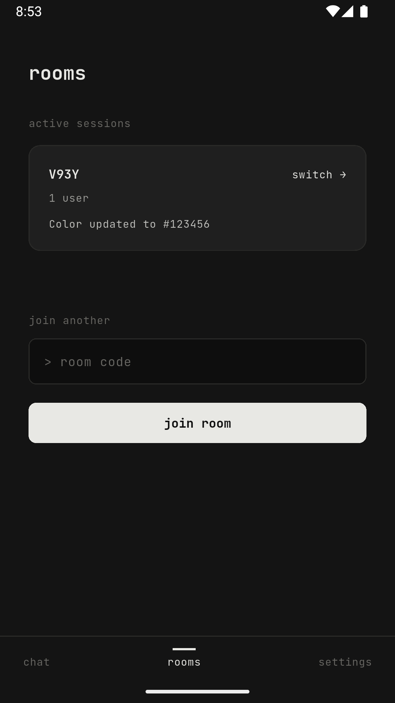
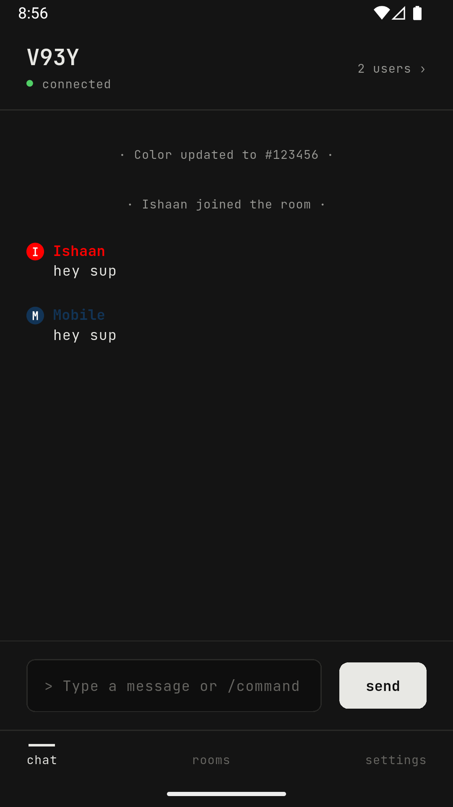
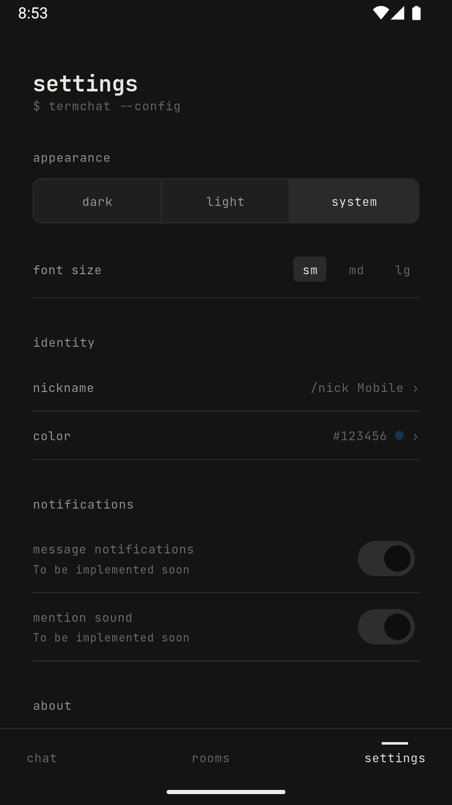

# termchat-mobile

> The official mobile client for [**termchat**](https://github.com/ishaan-jindal/termchat). Real-time, anonymous, room-based chat from your terminal, now on Android and iOS. Fully compatible with the `termchat` CLI.

Create a room, share a code, and start chatting instantly. Zero setup, zero tracking.

**No accounts. No profiles. No friction.**

---

## Screenshots

| Home | Rooms | Chat | Settings |
| :---: | :---: | :---: | :---: |
|  |  |  |  |
| Browse public rooms & create new ones | Manage your actively joined rooms | Real-time chat with online users drawer | Personalize your nickname, color, and theme |

---

## Features

- **Anonymous Real-Time Chat:** No signup, no login. Just pick a nickname and start chatting.
- **Ecosystem Compatibility:** Fully compatible with the existing `termchat` CLI. Chat with terminal users seamlessly!
- **Active Rooms Discovery:** Browse active public rooms directly from the home feed.
- **Multi-Chat Support:** Join and keep track of multiple rooms simultaneously, switching between them on the fly.
- **Security & Roles:** Support for password-protected rooms and automatic room host succession.
- **Customizable Identity:** Personalize your nickname and choose your unique color theme.
- **Aesthetics:** Sleek, modern terminal-inspired UI with system dark/light theme support.

---

## Tech Stack

- **Framework:** Flutter (Android & iOS)
- **State Management:** BLoC (with `flutter_bloc`)
- **Protocol:** Real-time WebSockets
- **Backend:** Go (`termchat` API backend)
- **Design:** Material 3 / Custom Terminal Aesthetics

---

## How It Works

### Room Lifecycle
- **On-Demand:** Rooms are temporary and created dynamically whenever a user joins a new room code.
- **Host Succession:** The first user to join a room becomes the host. When the host leaves, ownership is automatically transferred to the next oldest active participant.
- **Discovery:** Rooms can be public (discoverable on the home screen) or private (accessible only via a direct room code/password).

### Cross-Play Compatibility
`termchat-mobile` shares the same backend API protocol as the `termchat` CLI client, letting terminal users and mobile users chat in the same rooms in real time:

```text
  ┌─────────────────┐       ┌─────────────────┐
  │ Terminal Client │       │  Mobile Client  │
  └────────┬────────┘       └────────┬────────┘
           │                         │
           └───────────┬─────────────┘
                       ▼
               ┌───────────────┐
               │ termchat API  │
               └───────────────┘
```

---

## Running Locally

### Prerequisites
- [Flutter SDK](https://flutter.dev/docs/get-started/install) (latest stable version)
- Dart SDK

### Installation & Run

1. Clone this repository:
   ```bash
   git clone https://github.com/ishaan-jindal/termchat-mobile.git
   cd termchat-mobile
   ```

2. Install dependencies:
   ```bash
   flutter pub get
   ```

3. Run the development code generation:
   ```bash
   flutter pub run build_runner build --delete-conflicting-outputs
   ```

4. Run the app:
   ```bash
   flutter run
   ```

---

## Related Projects

- [termchat](https://github.com/ishaan-jindal/termchat) — Terminal-first chat client and backend.
- [termchat-mobile](https://github.com/ishaan-jindal/termchat-mobile) — Mobile companion application.

---

## License

This project is licensed under the [MIT License](LICENSE).
